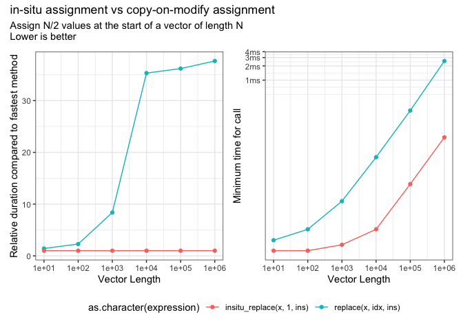
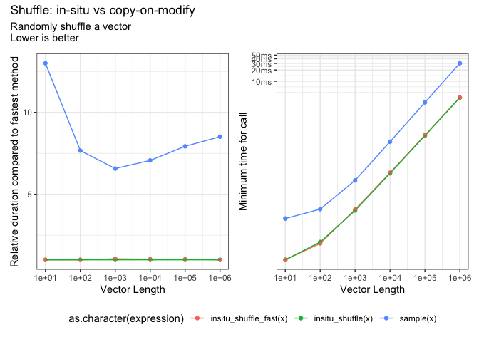
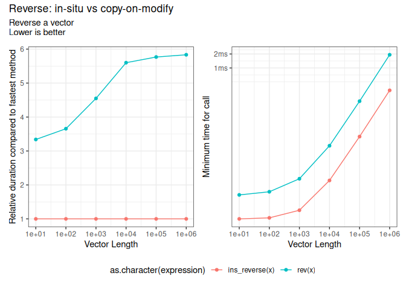

<!-- README.md is generated from README.Rmd. Please edit that file -->

# insitu

<!-- badges: start -->

 [](https://www.tidyverse.org/lifecycle/#experimental)
[](https://github.com/coolbutuseless/insitu/actions)
<!-- badges: end -->

`insitu` provides some functions for modifying vectors *in-situ* (in
place) without allocating a new vector.

This is an experimental package I wrote to try and figure out just how
fast things could be in R.

**Warning**: Modifying vectors in-situ can be fast, but doing so
violates some very strong norms within R internals.

**Warning**: Unless you are very confident on who has references to your
data, do not use this package for in-place modification.

## Modifying vectors in-place

**Pros** of modifying in-situ

  - Often faster as there is reduced memory allocation (and also reduced
    pressure on the garbage collector)
  - Often faster as there is no copying from the original vector into a
    new vector
  - By using C, we can override the *copy-on-modify* semantics usually
    used in R (regardless of how many references exist to the given
    object)

**Cons** of modifying in-situ

  - Normal R *copy-on-modify* behaviour is not followed - this will be a
    point of confusion as essentially everything in R uses
    *copy-on-modify* and not modification in-place.
  - Copying and allocating vectors is already very fast. It only takes a
    few *microseconds* to allocate memory for a vector of 1000 elements
    and assign new values into it. The speed saved by switching to
    in-situ modification will only possibly be useful if this operations
    is performed many, many times.

In the words of Luke Tierney in his User2020 keynote:

    You should never modify something without duplicating it.

This package ignores this advice. Beware.

## What’s in the box

| insitu                                     | description                                                            | integer | real | character |
| ------------------------------------------ | ---------------------------------------------------------------------- | ------- | ---- | --------- |
| insitu\_fill(x, value)                     | Fill vector with the given value                                       | Yes     | Yes  | Yes       |
| insitu\_fill\_runif(x, lower, upper)       | Fill vector with uniform random numbers                                | Yes     | Yes  |           |
| insitu\_fill\_runif\_fast(x, lower, upper) | Fill vector with uniform random numbers                                | Yes     | Yes  |           |
| insitu\_replace(x, pos, values)            | Replace values in x with given values starting from the given position | Yes     | Yes  | Yes       |
| insitu\_reverse(x)                         | Reverse vector                                                         | Yes     | Yes  | Yes       |
| insitu\_shuffle(x)                         | Shuffle the elements of a vector                                       | Yes     | Yes  | Yes       |
| insitu\_shuffle\_fast(x)                   | Shuffle the elements of a vector                                       | Yes     | Yes  | Yes       |
| insitu\_sort(x)                            | Sort the elements of a vector                                          | Yes     | Yes  |           |
|                                            |                                                                        |         |      |           |

#### Fast Variants

The `_fast` versions of some functions use their own random-number
generator rather than the one supplied in R. This generator is
[lehmer64](https://lemire.me/blog/2019/03/19/the-fastest-conventional-random-number-generator-that-can-pass-big-crush/).
It is very fast, but has different properties from R’s built in random
number generator. Use with caution.

#### ALTREP utils

  - `is_altrep(x)` tests whether an object is an ALTREP
  - `is_mutable(x)` tests whether an object is mutable in-place by
    checking its reference count
  - `get_refcnt(x)` returns the reference count for the object

## Installation

You can install from [GitHub](https://github.com/coolbutuseless/insitu)
with:

``` r
# install.package('remotes')
remotes::install_github('coolbutuseless/insitu')
```

## Future possibilities

  - In-place radix sort - instead of using `qsort()`
  - `cummin`, `cummax` etc
  - `negate`
  - `diff`

## In-situ Replacement

`insitu_replace()` is analogous to `replace()` but replaces values in
the current vector rather than creating a new one.

``` r
x <- integer(10)
insitu_replace(x, 6, 1:5)
x
#>  [1] 0 0 0 0 0 1 2 3 4 5
```

<details>

<summary> Click to show/hide benchmark code & results </summary>

``` r
#~~~~~~~~~~~~~~~~~~~~~~~~~~~~~~~~~~~~~~~~~~~~~~~~~~~~~~~~~~~~~~~~~~~~~~~~~~~~~
# Assign values into a vector
#~~~~~~~~~~~~~~~~~~~~~~~~~~~~~~~~~~~~~~~~~~~~~~~~~~~~~~~~~~~~~~~~~~~~~~~~~~~~~
N = c(1e1, 1e2, 1e3, 1e4, 1e5, 1e6)

res_rel <- bench::press(
  N = N,
  {
    x <- numeric(N)
    x[1] <- x[1]
    idx <- seq(1, N/2)
    ins <- as.numeric(idx)
    
    bench::mark(
      replace(x, idx, ins),
      insitu_replace(x, 1, ins),
      check    = TRUE,
      relative = TRUE
    )
  }
)

res_rel %>%
  select(expression, min, median, `itr/sec`, mem_alloc) %>%
  knitr::kable()
```

| expression                 |       min |    median |   itr/sec | mem\_alloc |
| :------------------------- | --------: | --------: | --------: | ---------: |
| replace(x, idx, ins)       |  1.318795 |  1.366805 |  1.000000 |        NaN |
| insitu\_replace(x, 1, ins) |  1.000000 |  1.000000 |  1.405195 |        NaN |
| replace(x, idx, ins)       |  2.186984 |  2.639138 |  1.000000 |   2.446429 |
| insitu\_replace(x, 1, ins) |  1.000000 |  1.000000 |  2.907017 |   1.000000 |
| replace(x, idx, ins)       |  5.718948 |  7.835692 |  1.000000 |   2.494071 |
| insitu\_replace(x, 1, ins) |  1.000000 |  1.000000 |  6.999441 |   1.000000 |
| replace(x, idx, ins)       | 17.788168 | 28.238494 |  1.000000 |   2.499401 |
| insitu\_replace(x, 1, ins) |  1.000000 |  1.000000 | 27.583230 |   1.000000 |
| replace(x, idx, ins)       | 20.674919 | 34.396881 |  1.000000 |   2.499940 |
| insitu\_replace(x, 1, ins) |  1.000000 |  1.000000 | 31.038628 |   1.000000 |
| replace(x, idx, ins)       | 18.896562 | 18.996776 |  1.000000 |   2.499994 |
| insitu\_replace(x, 1, ins) |  1.000000 |  1.000000 | 17.866816 |   1.000000 |

``` r

res_abs <- bench::press(
  N = N,
  {
    x <- numeric(N)
    x[1] <- x[1]
    idx <- seq(1, N/2)
    ins <- as.numeric(idx)
    
    bench::mark(
      replace(x, idx, ins),
      insitu_replace(x, 1, ins),
      check    = TRUE,
      relative = FALSE
    )
  }
)

res_abs %>%
  select(expression, min, median, `itr/sec`, mem_alloc) %>%
  knitr::kable()
```

| expression                 |      min |   median |     itr/sec | mem\_alloc |
| :------------------------- | -------: | -------: | ----------: | ---------: |
| replace(x, idx, ins)       |   1.25µs |   1.54µs | 508925.9753 |         0B |
| insitu\_replace(x, 1, ins) |      1µs |   1.11µs | 643199.2516 |         0B |
| replace(x, idx, ins)       |   2.17µs |   2.92µs | 276947.5809 |     1.07KB |
| insitu\_replace(x, 1, ins) |    977ns |   1.15µs | 741828.2586 |       448B |
| replace(x, idx, ins)       |   6.01µs |   7.61µs | 115976.4388 |     9.86KB |
| insitu\_replace(x, 1, ins) |   1.09µs |   1.33µs | 643010.8528 |     3.95KB |
| replace(x, idx, ins)       |  44.43µs |   87.6µs |  10759.4593 |    97.75KB |
| insitu\_replace(x, 1, ins) |   2.65µs |   3.16µs | 286725.0241 |    39.11KB |
| replace(x, idx, ins)       | 426.17µs | 785.32µs |   1265.3125 |   976.66KB |
| insitu\_replace(x, 1, ins) |   21.4µs |  25.11µs |  34786.0257 |   390.67KB |
| replace(x, idx, ins)       |   4.85ms |   5.32ms |    167.8546 |     9.54MB |
| insitu\_replace(x, 1, ins) | 246.42µs | 309.66µs |   2581.5064 |     3.81MB |

</details>



## In-situ fill

`insitu_fill()` is analogous to `replace()` but assigns the value into
the current vector rather than creating a new one.

``` r
x <- integer(10)
insitu_fill(x, 3L)
x
#>  [1] 3 3 3 3 3 3 3 3 3 3
```

<details>

<summary> Click to show/hide benchmark code & results </summary>

``` r
#~~~~~~~~~~~~~~~~~~~~~~~~~~~~~~~~~~~~~~~~~~~~~~~~~~~~~~~~~~~~~~~~~~~~~~~~~~~~~
# Assign values into a vector
#~~~~~~~~~~~~~~~~~~~~~~~~~~~~~~~~~~~~~~~~~~~~~~~~~~~~~~~~~~~~~~~~~~~~~~~~~~~~~
# N = c(1e1, 1e2, 1e3, 1e4, 1e5, 1e6)

res_rel <- bench::press(
  N = N,
  {
    x <- numeric(N)
    idx <- 1:N
    ins <- 99
    
    bench::mark(
      replace(x, idx, ins),
      insitu_fill(x, ins),
      check    = TRUE,
      relative = TRUE
    )
  }
)

res_rel %>%
  select(expression, min, median, `itr/sec`, mem_alloc) %>%
  knitr::kable()
```

| expression           |      min |   median |  itr/sec | mem\_alloc |
| :------------------- | -------: | -------: | -------: | ---------: |
| replace(x, idx, ins) | 1.537371 | 1.649336 | 1.000000 |        NaN |
| insitu\_fill(x, ins) | 1.000000 | 1.000000 | 1.720018 |        NaN |
| replace(x, idx, ins) | 1.640179 | 1.975220 | 1.000000 |        Inf |
| insitu\_fill(x, ins) | 1.000000 | 1.000000 | 2.040616 |        NaN |
| replace(x, idx, ins) | 1.000000 | 1.236853 | 1.000000 |        Inf |
| insitu\_fill(x, ins) | 1.015953 | 1.000000 | 1.374729 |        NaN |
| replace(x, idx, ins) | 1.000000 | 1.567109 | 1.000000 |        Inf |
| insitu\_fill(x, ins) | 1.289754 | 1.000000 | 1.594759 |        NaN |
| replace(x, idx, ins) | 1.000000 | 1.427888 | 1.000000 |        Inf |
| insitu\_fill(x, ins) | 1.342516 | 1.000000 | 1.413896 |        NaN |
| replace(x, idx, ins) | 1.000000 | 1.000000 | 1.000000 |        Inf |
| insitu\_fill(x, ins) | 1.163296 | 1.107503 | 1.010609 |        NaN |

``` r

res_abs <- bench::press(
  N = N,
  {
    x <- numeric(N)
    idx <- 1:N
    ins <- 99
    
    bench::mark(
      replace(x, idx, ins),
      insitu_fill(x, ins),
      check    = TRUE,
      relative = FALSE
    )
  }
)

res_abs %>%
  select(expression, min, median, `itr/sec`, mem_alloc) %>%
  knitr::kable()
```

| expression           |      min |   median |     itr/sec | mem\_alloc |
| :------------------- | -------: | -------: | ----------: | ---------: |
| replace(x, idx, ins) |   1.21µs |   1.57µs | 525851.2680 |         0B |
| insitu\_fill(x, ins) |    780ns |    876ns | 932610.3259 |         0B |
| replace(x, idx, ins) |   1.78µs |   2.16µs | 350689.4330 |     1.27KB |
| insitu\_fill(x, ins) |   1.16µs |   1.22µs | 678804.2764 |         0B |
| replace(x, idx, ins) |    4.6µs |   6.14µs | 134228.9987 |    11.81KB |
| insitu\_fill(x, ins) |   4.75µs |   4.96µs | 186886.5518 |         0B |
| replace(x, idx, ins) |  31.07µs |  69.97µs |  13322.7627 |   117.28KB |
| insitu\_fill(x, ins) |  39.36µs |  43.17µs |  22199.6076 |         0B |
| replace(x, idx, ins) | 277.85µs | 646.25µs |   1537.2812 |     1.15MB |
| insitu\_fill(x, ins) | 367.37µs | 433.01µs |   2297.6844 |         0B |
| replace(x, idx, ins) |   3.34ms |   4.13ms |    209.8936 |    11.44MB |
| insitu\_fill(x, ins) |   3.81ms |   4.44ms |    220.7952 |         0B |

</details>


## In-situ sort

`insitu_sort()` is analogous to `sort()` but sorts values in the current
vector rather than creating a new one.

``` r
x <- sample(10)
insitu_sort(x)
x
#>  [1]  1  2  3  4  5  6  7  8  9 10
```

<details>

<summary> Click to show/hide benchmark code & results </summary>

``` r
#~~~~~~~~~~~~~~~~~~~~~~~~~~~~~~~~~~~~~~~~~~~~~~~~~~~~~~~~~~~~~~~~~~~~~~~~~~~~~
# Assign values into a vector
#~~~~~~~~~~~~~~~~~~~~~~~~~~~~~~~~~~~~~~~~~~~~~~~~~~~~~~~~~~~~~~~~~~~~~~~~~~~~~
# N = c(1e1, 1e2, 1e3, 1e4, 1e5, 1e6)

res_rel <- bench::press(
  N = N,
  {
    x <- runif(N)

    bench::mark(
      sort(x),
      insitu_sort(x),
      check    = TRUE,
      relative = TRUE
    )
  }
)

res_rel %>%
  select(expression, min, median, `itr/sec`, mem_alloc) %>%
  knitr::kable()
```

| expression      |       min |    median |   itr/sec | mem\_alloc |
| :-------------- | --------: | --------: | --------: | ---------: |
| sort(x)         | 52.228386 | 53.371954 |  1.000000 |        NaN |
| insitu\_sort(x) |  1.000000 |  1.000000 | 48.621550 |        NaN |
| sort(x)         | 29.887509 | 31.619048 |  1.000000 |        Inf |
| insitu\_sort(x) |  1.000000 |  1.000000 | 32.253261 |        NaN |
| sort(x)         |  6.486212 |  7.284327 |  1.000000 |        Inf |
| insitu\_sort(x) |  1.000000 |  1.000000 |  7.946044 |        NaN |
| sort(x)         |  1.880575 |  2.654858 |  1.000000 |        Inf |
| insitu\_sort(x) |  1.000000 |  1.000000 |  2.795927 |        NaN |
| sort(x)         |  1.075207 |  1.761023 |  1.000000 |        Inf |
| insitu\_sort(x) |  1.000000 |  1.000000 |  1.749266 |        NaN |
| sort(x)         |  1.103082 |  1.635931 |  1.000000 |        Inf |
| insitu\_sort(x) |  1.000000 |  1.000000 |  1.538793 |        NaN |

``` r

res_abs <- bench::press(
  N = N,
  {
    x <- runif(N)
    
    bench::mark(
      sort(x),
      insitu_sort(x),
      check    = TRUE,
      relative = FALSE
    )
  }
)

res_abs %>%
  select(expression, min, median, `itr/sec`, mem_alloc) %>%
  knitr::kable()
```

| expression      |      min |   median |      itr/sec | mem\_alloc |
| :-------------- | -------: | -------: | -----------: | ---------: |
| sort(x)         |  39.37µs |  47.36µs |   19438.7729 |         0B |
| insitu\_sort(x) |    753ns |    838ns | 1066202.8774 |         0B |
| sort(x)         |   40.3µs |  49.11µs |   18410.5882 |     1.27KB |
| insitu\_sort(x) |   1.39µs |   1.66µs |  470201.1655 |         0B |
| sort(x)         |  47.79µs |  56.55µs |   15551.9221 |    11.81KB |
| insitu\_sort(x) |   6.92µs |   7.71µs |  120974.8387 |         0B |
| sort(x)         | 109.89µs | 175.56µs |    5072.7293 |   117.28KB |
| insitu\_sort(x) |   60.2µs |  67.18µs |   14488.6614 |         0B |
| sort(x)         | 680.03µs |   1.19ms |     815.8679 |     1.15MB |
| insitu\_sort(x) | 591.87µs | 670.94µs |    1468.7447 |         0B |
| sort(x)         |   6.77ms |   9.48ms |     106.3346 |    11.44MB |
| insitu\_sort(x) |   6.02ms |   6.66ms |     145.3084 |         0B |

</details>


## In-situ Shuffle

`insitu_shuffle()` is analogous to `sample()` but shuffles values in the
current vector rather than creating a new one.

``` r
x <- c(0, 1, 2, 3, 4, 5, 6, 7, 8, 9)
insitu_shuffle(x)
x
#>  [1] 0 8 3 4 1 2 7 9 6 5
```

<details>

<summary> Click to show/hide benchmark code & results </summary>

``` r
#~~~~~~~~~~~~~~~~~~~~~~~~~~~~~~~~~~~~~~~~~~~~~~~~~~~~~~~~~~~~~~~~~~~~~~~~~~~~~
# Assign values into a vector
#~~~~~~~~~~~~~~~~~~~~~~~~~~~~~~~~~~~~~~~~~~~~~~~~~~~~~~~~~~~~~~~~~~~~~~~~~~~~~
# N = c(1e1, 1e2, 1e3, 1e4, 1e5, 1e6)

res_rel <- bench::press(
  N = N,
  {
    x <- runif(N)

    bench::mark(
      sample(x),
      insitu_shuffle(x),
      insitu_shuffle_fast(x),
      check    = FALSE,
      relative = TRUE
    )
  }
)

res_rel %>%
  select(expression, min, median, `itr/sec`, mem_alloc) %>%
  knitr::kable()
```

| expression               |       min |    median |   itr/sec | mem\_alloc |
| :----------------------- | --------: | --------: | --------: | ---------: |
| sample(x)                |  8.116942 |  8.368873 |  1.000000 |        Inf |
| insitu\_shuffle(x)       |  1.000000 |  1.000000 |  8.863654 |        NaN |
| insitu\_shuffle\_fast(x) |  2.485757 |  2.712010 |  3.293433 |        Inf |
| sample(x)                |  5.229228 |  5.623357 |  1.000000 |        Inf |
| insitu\_shuffle(x)       |  1.000000 |  1.000000 |  5.390518 |        NaN |
| insitu\_shuffle\_fast(x) |  1.172068 |  1.268959 |  4.251564 |        Inf |
| sample(x)                |  8.399919 |  7.881430 |  1.000000 |        Inf |
| insitu\_shuffle(x)       |  2.388788 |  2.234609 |  3.623493 |        NaN |
| insitu\_shuffle\_fast(x) |  1.000000 |  1.000000 |  8.289436 |        Inf |
| sample(x)                | 11.732432 | 13.213498 |  1.000000 |        Inf |
| insitu\_shuffle(x)       |  3.149990 |  3.237872 |  4.073875 |        NaN |
| insitu\_shuffle\_fast(x) |  1.000000 |  1.000000 | 12.845540 |        Inf |
| sample(x)                | 13.996189 | 15.630416 |  1.000000 |        Inf |
| insitu\_shuffle(x)       |  3.220568 |  3.437205 |  4.459315 |        NaN |
| insitu\_shuffle\_fast(x) |  1.000000 |  1.000000 | 15.219586 |        Inf |
| sample(x)                | 12.785841 | 11.292401 |  1.000000 |        Inf |
| insitu\_shuffle(x)       |  2.943140 |  3.205066 |  3.555412 |        NaN |
| insitu\_shuffle\_fast(x) |  1.000000 |  1.000000 | 10.511090 |        Inf |

``` r

res_abs <- bench::press(
  N = N,
  {
    x <- runif(N)
    
    bench::mark(
      sample(x),
      insitu_shuffle(x),
      insitu_shuffle_fast(x),
      check    = FALSE,
      relative = FALSE
    )
  }
)

res_abs %>%
  select(expression, min, median, `itr/sec`, mem_alloc) %>%
  knitr::kable()
```

| expression               |      min |   median |      itr/sec | mem\_alloc |
| :----------------------- | -------: | -------: | -----------: | ---------: |
| sample(x)                |   5.27µs |   6.75µs | 1.275360e+05 |     2.49KB |
| insitu\_shuffle(x)       |    676ns |    826ns | 1.104036e+06 |         0B |
| insitu\_shuffle\_fast(x) |   1.66µs |   2.13µs | 4.186363e+05 |     2.49KB |
| sample(x)                |   8.83µs |  11.06µs | 8.117102e+04 |      4.2KB |
| insitu\_shuffle(x)       |   1.67µs |   1.88µs | 4.811292e+05 |         0B |
| insitu\_shuffle\_fast(x) |   1.98µs |   2.49µs | 3.647146e+05 |     2.49KB |
| sample(x)                |   42.3µs |  46.33µs | 1.997974e+04 |    18.27KB |
| insitu\_shuffle(x)       |  11.76µs |  13.45µs | 6.462398e+04 |         0B |
| insitu\_shuffle\_fast(x) |   5.19µs |   6.17µs | 1.277038e+05 |     2.49KB |
| sample(x)                | 426.03µs | 506.37µs | 1.812763e+03 |   158.89KB |
| insitu\_shuffle(x)       | 111.75µs | 126.88µs | 7.670510e+03 |         0B |
| insitu\_shuffle\_fast(x) |  35.43µs |  37.61µs | 2.454974e+04 |     2.49KB |
| sample(x)                |   5.24ms |   6.44ms | 1.524378e+02 |     1.53MB |
| insitu\_shuffle(x)       |   1.21ms |   1.44ms | 6.719811e+02 |         0B |
| insitu\_shuffle\_fast(x) |  376.1µs | 420.72µs | 2.268904e+03 |     2.49KB |
| sample(x)                |  78.81ms |   83.8ms | 1.206565e+01 |    15.26MB |
| insitu\_shuffle(x)       |  18.64ms |   23.3ms | 4.299892e+01 |         0B |
| insitu\_shuffle\_fast(x) |   6.17ms |   7.77ms | 1.242718e+02 |     2.49KB |

</details>



## In-situ Reverse

`insitu_reverse()` is analogous to `rev()` but reverses values in the
current vector rather than creating a new one.

``` r
x <- c(0, 1, 2, 3, 4, 5, 6, 7, 8, 9)
insitu_reverse(x)
x
#>  [1] 9 8 7 6 5 4 3 2 1 0
```

<details>

<summary> Click to show/hide benchmark code & results </summary>

``` r
#~~~~~~~~~~~~~~~~~~~~~~~~~~~~~~~~~~~~~~~~~~~~~~~~~~~~~~~~~~~~~~~~~~~~~~~~~~~~~
# Assign values into a vector
#~~~~~~~~~~~~~~~~~~~~~~~~~~~~~~~~~~~~~~~~~~~~~~~~~~~~~~~~~~~~~~~~~~~~~~~~~~~~~
# N = c(1e1, 1e2, 1e3, 1e4, 1e5, 1e6)

res_rel <- bench::press(
  N = N,
  {
    x <- runif(N)

    bench::mark(
      rev(x),
      insitu_reverse(x),
      check    = TRUE,
      relative = TRUE
    )
  }
)

res_rel %>%
  select(expression, min, median, `itr/sec`, mem_alloc) %>%
  knitr::kable()
```

| expression         |      min |    median |   itr/sec | mem\_alloc |
| :----------------- | -------: | --------: | --------: | ---------: |
| rev(x)             | 4.386874 |  5.118976 |  1.000000 |        NaN |
| insitu\_reverse(x) | 1.000000 |  1.000000 |  5.478068 |        NaN |
| rev(x)             | 5.172920 |  6.228933 |  1.000000 |        Inf |
| insitu\_reverse(x) | 1.000000 |  1.000000 |  6.626322 |        NaN |
| rev(x)             | 5.530591 |  6.303030 |  1.000000 |        Inf |
| insitu\_reverse(x) | 1.000000 |  1.000000 |  6.362386 |        NaN |
| rev(x)             | 6.423911 | 17.160613 |  1.000000 |        Inf |
| insitu\_reverse(x) | 1.000000 |  1.000000 | 16.501612 |        NaN |
| rev(x)             | 6.710462 | 16.740693 |  1.000000 |        Inf |
| insitu\_reverse(x) | 1.000000 |  1.000000 | 16.504740 |        NaN |
| rev(x)             | 6.286749 |  6.845207 |  1.000000 |        Inf |
| insitu\_reverse(x) | 1.000000 |  1.000000 |  7.172104 |        NaN |

``` r

res_abs <- bench::press(
  N = N,
  {
    x <- runif(N)
    
    bench::mark(
      rev(x),
      insitu_reverse(x),
      check    = TRUE,
      relative = FALSE
    )
  }
)

res_abs %>%
  select(expression, min, median, `itr/sec`, mem_alloc) %>%
  knitr::kable()
```

| expression         |      min |   median |     itr/sec | mem\_alloc |
| :----------------- | -------: | -------: | ----------: | ---------: |
| rev(x)             |   2.48µs |   3.27µs |  273054.660 |         0B |
| insitu\_reverse(x) |    564ns |    666ns | 1150388.567 |         0B |
| rev(x)             |   2.87µs |   3.49µs |  235789.369 |     1.27KB |
| insitu\_reverse(x) |    594ns |    679ns | 1173182.364 |         0B |
| rev(x)             |   5.28µs |   6.95µs |  123245.318 |    11.81KB |
| insitu\_reverse(x) |    933ns |   1.01µs |  926925.975 |         0B |
| rev(x)             |  28.05µs |   84.1µs |   11126.449 |   117.28KB |
| insitu\_reverse(x) |   4.36µs |   4.79µs |  194778.059 |         0B |
| rev(x)             | 296.91µs | 768.54µs |    1240.619 |     1.15MB |
| insitu\_reverse(x) |  39.39µs |  44.85µs |   20993.454 |         0B |
| rev(x)             |   2.89ms |    3.7ms |     230.797 |    11.44MB |
| insitu\_reverse(x) | 438.67µs | 553.18µs |    1562.767 |         0B |

</details>



## In-situ fill with random

`insitu_fill_runif()` is analogous to `runif()` but generates values in
the current vector rather than creating a new one.

``` r
x <- integer(10)
insitu_fill_runif(x, 10, 15)
x
#>  [1] 12 13 14 10 10 12 14 10 11 14
```

<details>

<summary> Click to show/hide benchmark code & results </summary>

``` r
#~~~~~~~~~~~~~~~~~~~~~~~~~~~~~~~~~~~~~~~~~~~~~~~~~~~~~~~~~~~~~~~~~~~~~~~~~~~~~
# Assign values into a vector
#~~~~~~~~~~~~~~~~~~~~~~~~~~~~~~~~~~~~~~~~~~~~~~~~~~~~~~~~~~~~~~~~~~~~~~~~~~~~~
# N = c(1e1, 1e2, 1e3, 1e4, 1e5, 1e6)

res_rel <- bench::press(
  N = N,
  {
    x <- numeric(N)

    bench::mark(
      runif(x),
      insitu_fill_runif(x, 0, 1),
      insitu_fill_runif_fast(x, 0, 1),
      check    = FALSE,
      relative = TRUE
    )
  }
)

res_rel %>%
  select(expression, min, median, `itr/sec`, mem_alloc) %>%
  knitr::kable()
```

| expression                         |       min |    median |   itr/sec | mem\_alloc |
| :--------------------------------- | --------: | --------: | --------: | ---------: |
| runif(x)                           |  2.054696 |  2.468750 |  1.000000 |        Inf |
| insitu\_fill\_runif(x, 0, 1)       |  1.000000 |  1.000000 |  2.384733 |        NaN |
| insitu\_fill\_runif\_fast(x, 0, 1) |  1.969040 |  2.229754 |  1.128255 |        Inf |
| runif(x)                           |  2.693405 |  3.019129 |  1.000000 |        Inf |
| insitu\_fill\_runif(x, 0, 1)       |  1.000000 |  1.000000 |  2.983334 |        NaN |
| insitu\_fill\_runif\_fast(x, 0, 1) |  1.201426 |  1.540914 |  1.792748 |        Inf |
| runif(x)                           |  8.406731 |  7.149361 |  1.000000 |        Inf |
| insitu\_fill\_runif(x, 0, 1)       |  2.887148 |  2.420984 |  2.930886 |        NaN |
| insitu\_fill\_runif\_fast(x, 0, 1) |  1.000000 |  1.000000 |  6.429227 |        Inf |
| runif(x)                           | 17.330676 | 19.602201 |  1.000000 |        Inf |
| insitu\_fill\_runif(x, 0, 1)       |  5.828820 |  6.105544 |  3.232811 |        NaN |
| insitu\_fill\_runif\_fast(x, 0, 1) |  1.000000 |  1.000000 | 18.780137 |        Inf |
| runif(x)                           | 19.282143 | 21.234812 |  1.000000 |        Inf |
| insitu\_fill\_runif(x, 0, 1)       |  6.593796 |  6.744453 |  3.112040 |        NaN |
| insitu\_fill\_runif\_fast(x, 0, 1) |  1.000000 |  1.000000 | 21.118979 |        Inf |
| runif(x)                           | 20.048277 | 21.483435 |  1.000000 |        Inf |
| insitu\_fill\_runif(x, 0, 1)       |  6.930865 |  6.761348 |  2.997867 |        NaN |
| insitu\_fill\_runif\_fast(x, 0, 1) |  1.000000 |  1.000000 | 19.800135 |        Inf |

``` r

res_abs <- bench::press(
  N = N,
  {
    x <- numeric(N)
    
    bench::mark(
      runif(x),
      insitu_fill_runif(x, 0, 1),
      insitu_fill_runif_fast(x, 0, 1),
      check    = FALSE,
      relative = FALSE
    )
  }
)

res_abs %>%
  select(expression, min, median, `itr/sec`, mem_alloc) %>%
  knitr::kable()
```

| expression                         |      min |   median |      itr/sec | mem\_alloc |
| :--------------------------------- | -------: | -------: | -----------: | ---------: |
| runif(x)                           |   1.97µs |   2.67µs | 325402.65234 |     2.49KB |
| insitu\_fill\_runif(x, 0, 1)       |    956ns |   1.12µs | 800512.90190 |         0B |
| insitu\_fill\_runif\_fast(x, 0, 1) |   1.93µs |   2.62µs | 308298.72613 |     2.49KB |
| runif(x)                           |   4.47µs |   5.53µs | 157439.21292 |     3.32KB |
| insitu\_fill\_runif(x, 0, 1)       |   1.74µs |   1.98µs | 446344.46333 |         0B |
| insitu\_fill\_runif\_fast(x, 0, 1) |    2.1µs |   2.72µs | 319590.73970 |     2.49KB |
| runif(x)                           |  28.92µs |  32.17µs |  29200.44435 |    10.35KB |
| insitu\_fill\_runif(x, 0, 1)       |  10.23µs |  11.44µs |  81478.37824 |         0B |
| insitu\_fill\_runif\_fast(x, 0, 1) |   3.44µs |   4.27µs | 207607.27532 |     2.49KB |
| runif(x)                           | 287.46µs | 358.79µs |   2644.79326 |    80.66KB |
| insitu\_fill\_runif(x, 0, 1)       |  98.33µs | 108.48µs |   8857.55888 |         0B |
| insitu\_fill\_runif\_fast(x, 0, 1) |  16.67µs |   18.4µs |  50070.26359 |     2.49KB |
| runif(x)                           |   2.87ms |   3.37ms |    292.91045 |   783.79KB |
| insitu\_fill\_runif(x, 0, 1)       | 943.21µs |   1.06ms |    927.19790 |         0B |
| insitu\_fill\_runif\_fast(x, 0, 1) | 143.28µs | 154.03µs |   6186.54899 |     2.49KB |
| runif(x)                           |   29.3ms |  32.22ms |     31.15854 |     7.63MB |
| insitu\_fill\_runif(x, 0, 1)       |   9.86ms |  10.71ms |     92.45940 |         0B |
| insitu\_fill\_runif\_fast(x, 0, 1) |   1.47ms |   1.63ms |    593.98457 |     2.49KB |

</details>


## Related Software

  - [data.table](https://cran.r-project.org/package=data.table) performs
    a lot of operations in-situ (which data.table calls “by reference”)

## Acknowledgements

  - R Core for developing and maintaining the language.
  - CRAN maintainers, for patiently shepherding packages onto CRAN and
    maintaining the repository
